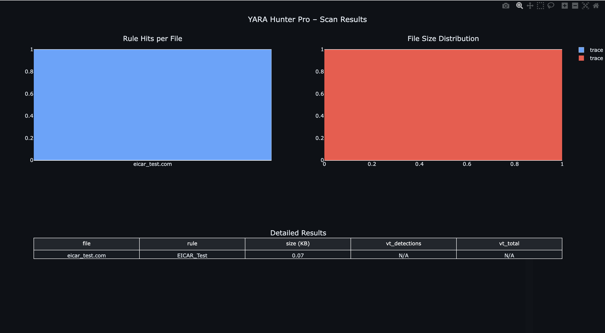

# YARA Hunter Pro – macOS-native Malware Scanner & Dashboard

Automated YARA 4.5.4 scanner with VirusTotal enrichment and **interactive Plotly dashboard**.

### Features
- Scans files with custom + built-in YARA rules
- Real-time VirusTotal reputation lookup
- Beautiful dark-mode interactive HTML report (heatmaps, tables, charts)
- Native macOS + Docker support

### Demo


### Run in 60 Seconds
```bash
git clone https://github.com/kleckie7/yara-hunter-pro.git
cd yara-hunter-pro
python3 -m venv venv && source venv/bin/activate
pip install -r requirements.txt
./main.py
